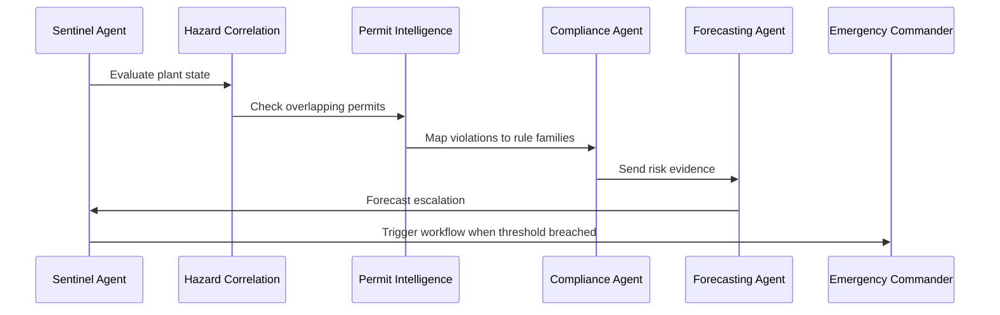

# Agent Flow

```mermaid
sequenceDiagram
  participant S as Sentinel Agent
  participant R as Hazard Correlation
  participant P as Permit Intelligence
  participant C as Compliance Agent
  participant F as Forecasting Agent
  participant E as Emergency Commander
  S->>R: Evaluate plant state
  R->>P: Check overlapping permits
  P->>C: Map violations to rule families
  C->>F: Send risk evidence
  F->>S: Forecast escalation
  S->>E: Trigger workflow when threshold breached
```
