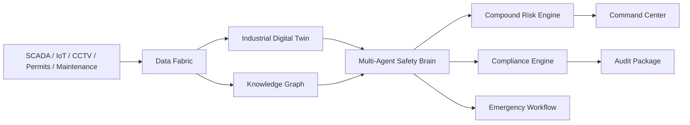

# System Architecture

```mermaid
flowchart LR
  SCADA["SCADA / IoT / CCTV / Permits / Maintenance"] --> Fabric["Data Fabric"]
  Fabric --> Twin["Industrial Digital Twin"]
  Fabric --> KG["Knowledge Graph"]
  Twin --> Agents["Multi-Agent Safety Brain"]
  KG --> Agents
  Agents --> Risk["Compound Risk Engine"]
  Agents --> Compliance["Compliance Engine"]
  Risk --> Command["Command Center"]
  Compliance --> Audit["Audit Package"]
  Agents --> Workflow["Emergency Workflow"]
```
